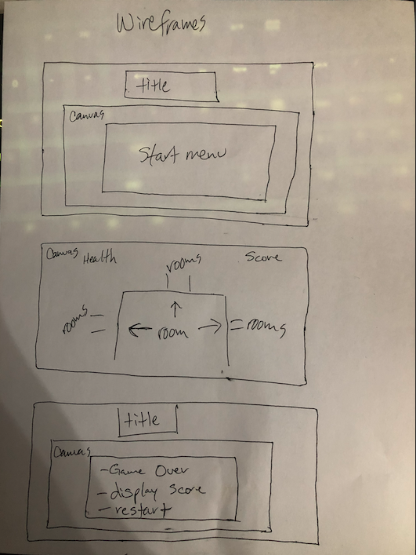

# Project_One

# 2021 - A Zombie Survival Game

## Game idea

2D Dungeon crawler where you're in a house full of zombies trying to clear out the house to survive for the night.
Each room will spawn a random amount of zombies to fight off. Health will be low and once dead, the game will give a game over and you have to restart.

No one quite knows how it started, WW3, Corona, tear gas, the "deep fake". But whatever it was, it ended with zombies. Those who survived are now stuck scavenging for food and shelter. Enter you, it's late and your group has tasked you with clearing out and finding shelter before it gets too late.

## Wireframe

## Tech Stack

- HTML/CSS
- Javascript
- Phaser.js 2

## MVP Goals

- sprite enters room
- zombies spawn
- sprite defeats zombies (thows knife or swings sword)
- move to next room, repeat
- score increase with each kill

## Stretch Goals

- LOTS OF ROOMS!!!
- different weapons
- zombie boss in specific room
- health regen abilities (i.e. find a heart = gain more life)
- cool sound effects
- Add your own name
- time attack mode - race against the clock.

## Roadblocks

- Don't know how to use phaser yet
- Need to get better with grid